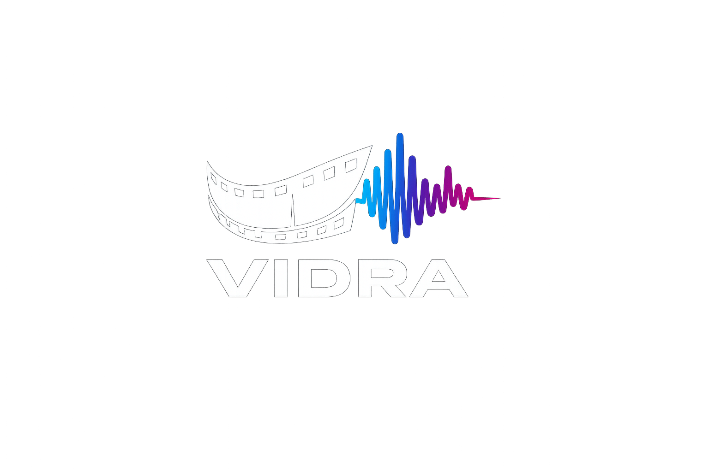

<br/>

<p align="center">
  <strong>VIDRA</strong> — pipeline local de dublagem automática de vídeos.
  <br/>Transcreve, traduz, sintetiza voz e dubla — <strong>100% offline</strong>.
</p>

<br/>

<p align="center">
  
  
  
  
  
  
</p>

---

## Funcionalidades

- **Download** — vídeo do YouTube via yt-dlp, ou use um **arquivo local**
- **Transcrição** — Vosk word-level com timestamps precisos
- **Tradução** — GoogleTranslator com fallback offline
- **Voz sintética** — Piper TTS com vozes PT-BR e EN-US
- **Dublagem** — substitui falas nos timestamps exatos
- **Exportação** — SRT + JSON + MP4 final (sem re-encode do vídeo)
- **Idiomas**: `en -> pt` ou `pt -> en`

---

## Instalação

### Pré-requisitos

| Arch Linux | Debian / Ubuntu | macOS (Homebrew) |
|---|---|---|
| `sudo pacman -S ffmpeg wget unzip python` | `sudo apt install ffmpeg wget unzip python3 python3-venv` | `brew install ffmpeg wget unzip python` |

### Setup

```bash
git clone https://github.com/seu-usuario/vidra.git
cd vidra
bash install.sh          # .venv + modelos (~80 MB)
source .venv/bin/activate
```

---

## Uso

### Modo interativo (recomendado)

```bash
python main.py
```

Menu com opções de entrada, direção de idioma e configuração.

### Linha de comando

```bash
# YouTube -> Português
python main.py -u "https://youtube.com/watch?v=..."

# Arquivo local -> Português
python main.py -f "/tmp/video.mp4"

# YouTube -> Inglês (dubla PT-BR para EN-US)
python main.py -u "..." --direction pt2en

# Vídeo local, direção personalizada
python main.py -f "video.mp4" -s en -t pt

# Retomar pipeline interrompido
python main.py -u "..." --resume

# Listar modelos instalados
python main.py --list-models
```

### Direções suportadas

| Flag | Origem | Destino | Status |
|---|---|---|---|
| `--direction en2pt` | Inglês | Português | ✅ |
| `--direction pt2en` | Português | Inglês | ✅ |

---

## Configuração

Edite `vidra.json` para definir padrões:

```json
{
  "language": {
    "source": "en",
    "target": "pt"
  },
  "tts": {
    "parallel_workers": 4,
    "sample_rate": 22050
  }
}
```

Ou use o menu interativo (`python main.py` > Configurações).

---

## Pipeline

```
Entrada (URL ou arquivo local)
  -> yt-dlp / ffmpeg
  -> Vosk (transcricao word-level)
  -> Agrupamento por pausa (>0.3s) ou tamanho (max 25 palavras)
  -> GoogleTranslator (com fallback offline)
  -> Piper TTS (paralelo, N workers)
  -> Dub (substituicao nos timestamps)
  -> Merge (c:v copy, sem re-encode)
  -> MP4 final em output/
```

---

## Estrutura

```
vidra/
├── vidra.json               # Configuracao (idioma, workers, modelos)
├── main.py                  # CLI + menu interativo
├── install.sh               # Setup .venv + modelos
├── requirements.txt
├── src/
│   ├── configs.py           # Le vidra.json, lookup de modelos
│   ├── core/
│   │   ├── input.py         # Download (yt-dlp) + import local
│   │   ├── audio_manager.py # Transcricao, TTS paralelo, dub, merge
│   │   ├── translate.py     # 3 engines com fallback
│   │   └── session.py       # Checkpoint/resume
│   └── utils/
│       ├── colors.py        # ANSI colors
│       └── logger.py        # Logging
├── models/                  # Modelos Vosk + Piper
└── .vidra/                  # Dados temporarios + checkpoints
    ├── tmp/
    └── checkpoints/

output/                      # Videos dublados (final)
```

---

## Stack

| Tecnologia | Função |
|---|---|
| [yt-dlp](https://github.com/yt-dlp/yt-dlp) | Download YouTube |
| [Vosk](https://alphacephei.com/vosk/) | Speech-to-Text |
| [Piper TTS](https://github.com/rhasspy/piper) | Text-to-Speech |
| [deep-translator](https://github.com/nidhaloff/deep-translator) | Tradução |
| [FFmpeg](https://ffmpeg.org/) | Áudio/Vídeo |
| [questionary](https://github.com/tmbo/questionary) | Interface interativa |

---

## Licença

MIT © 2026
